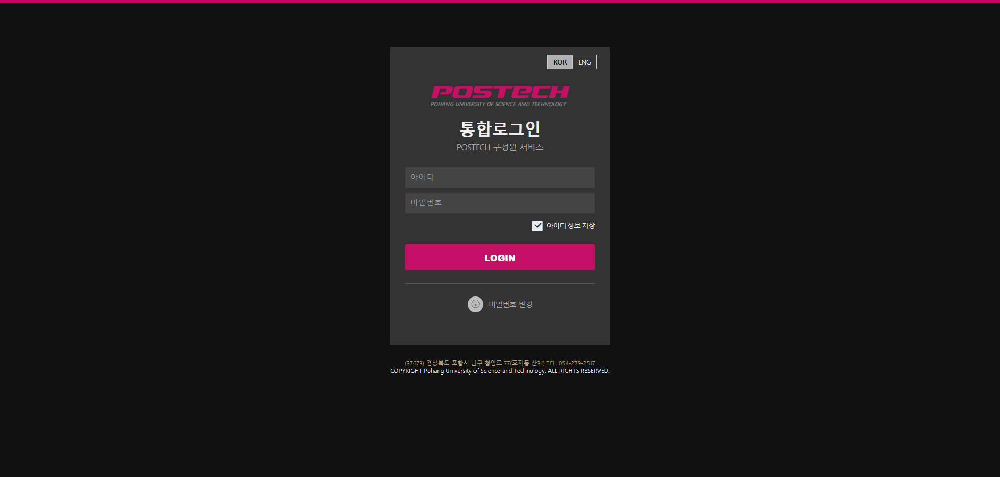
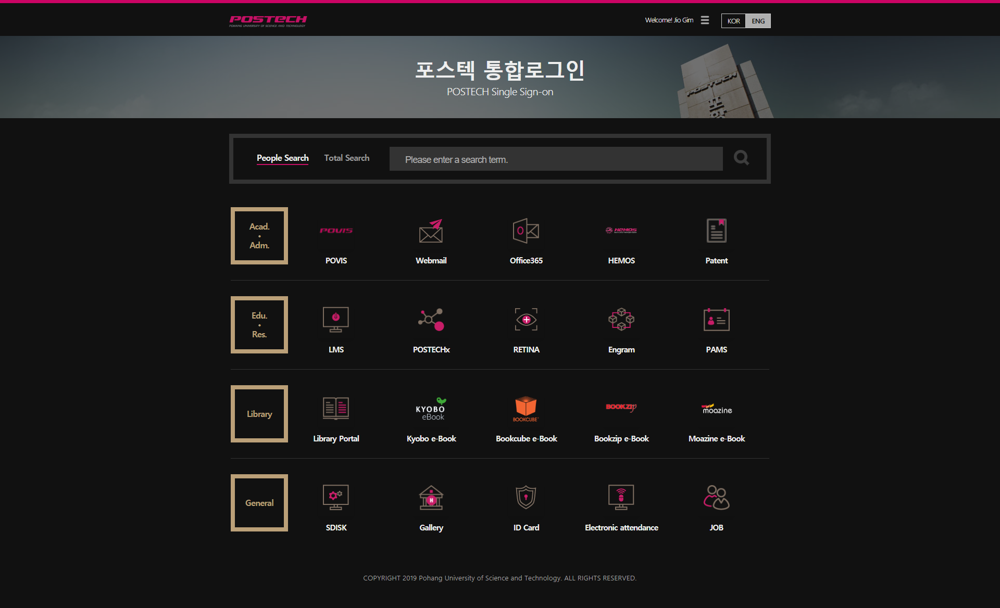

POSTECH SSO Dark Mode
=====================

This darkens POSTECH SSO login & portal page (login.postech.ac.kr).

Preview
-------

| Login Page | Portal Page |
|:----------:|:-----------:|
|||

How To Apply
------------

Dark mode will work only if a browser extension "Stylus" installed on your browser. It is available on Chrome, Chromium Edge, Firefox, Opera.

Stylus ables user to change styles of selected pages to follow user's preference. This dark mode only works for login.postech.ac.kr and sso.postech.ac.kr domain.

Due to the limitations of web browsers, this extension only works on desktop/laptop browser. Unfortunately, there're no options for iOS and Android.

You can download Stylus from the links below:

- Chrome Extension Store: https://chrome.google.com/webstore/detail/stylus-beta/apmmpaebfobifelkijhaljbmpcgbjbdo
- Firefox Addons: https://addons.mozilla.org/firefox/addon/styl-us/
- Opera Addons: https://addons.opera.com/extensions/details/stylus/

After installing Stylus, you can click the button below and the dark mode installation page will be shown up automatically.

📦 [Install POSTECH SSO Dark Mode](https://raw.githubusercontent.com/wldh-g/postech-sso-dark/master/POSTECH-SSO-Dark.user.css).

Then you can press "Install style" button. The installation will be done and and the application will be finished.

Because automatic style updating is enabled, the extension will often check for update of this dark mode.

If any bugs are found, please [make an issue](https://github.com/wldh-g/postech-sso-dark/issues/new), then I'll update this mod quickly.

To Do
-----

- [ ] Clearify Icons (POVIS, PIPA, Bookzip)
- [ ] Chang Icon Layout (HEMOS)
- [ ] Covert to SASS
- [ ] Change to padding transition, not tranform-scaling.

License
-------

This user css is not licensed.

Original system: &copy; POSTECH IT Service.
